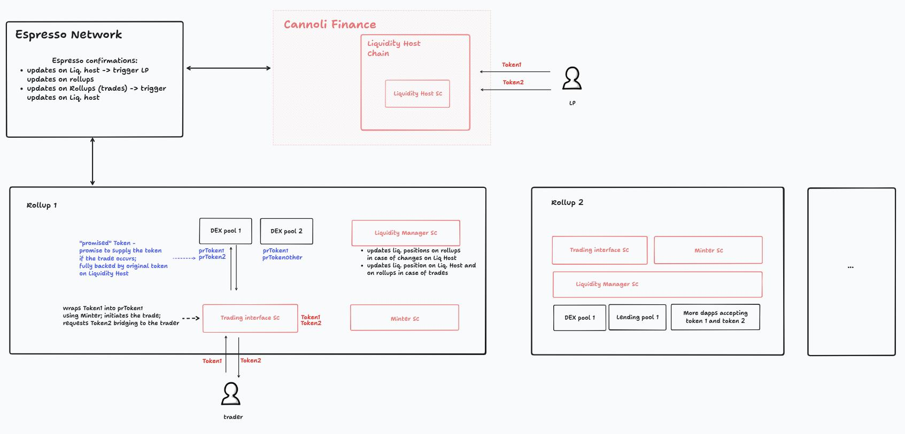

## Cannoli Finance

Cannoli Finance. Goes perfectly well with Espresso.

Cannoli is a platform that makes LPs dreams about earning yield on a token as if they were providing it to the pools on all networks come true. In short, Cannoli multiplies capital efficiency.

A sigle nitro rollup - the Liquidity hub - aceepts the liquidity, which earns yield on rollups connected to Espresso. Espresso serves as the source of confirmation that changes in liquidity occured on the Liquidity hub and confirmations of trades on connected rollups.



#### Usage
Provide liquidity to the liquidity hub in USDC and USDT:
```
cast send "$liquidity_hub_address" "deposit(address[],uint256[])" "[$usdc_address,$usdt_address]" "[$usdc_deposit_amount,$usdt_deposit_amount]" --rpc-url "$hub_rpc_url" --private-key "$hub_deployer_private_key"
cast send "$liquidity_hub_address" "mintLP(uint256[],address[],uint256[],address[])" "[$mint_amounts1]" "[$usdc_address,$usdt_address]" "[$mint_chains1]" "[$mint_pools1]" --rpc-url "$hub_rpc_url" --private-key "$hub_deployer_private_key"
```
(mock tokens faucet upcoming soon)

rollup1 will be updated with new liquidity in prUSDT-prUSDC pool


#### Deployments
Liquidity Hub chain
chain id: 6656
LiquidityHub deployed to: 0x0E3B25EAcCb0dc99CA7f4eE7A278D6287167F39a
USDC deployed to: 0xaB83d3382EE396Ab805085AE9A90711d03C56185 
USDT deployed to: 0x7b3cf1eCBd6484a55aE89857A8d40cBEb2Cb24aB 

Rollup 1 
chain id: 6657
LiquidityManager on Rollup 1 deployed to: 0x2b612Ebf9dB15067A754A201Fb940497fc82F6F1
Minter on Rollup 1 deployed to: 0xF5fA553350E91c1Fe0a3D8fF872360a02899c21D
DexInterface on Rollup 1 deployed to: 0x54C670Af5C2Cf899DDe335063e34546517279401
USDC deployed to: 0xe87524Ca78038a1dAEe48F1f1056A8d559DF70Cf 
USDT deployed to: 0x6eBBf7469EB1eC8C8609F1703Cd4B04FF829cbC7 
prUSDC on Rollup 1 deployed to: 0xbFEebd7cAd3c7cDDE1f4662A9151055C6bFE1dca
prUSDT on Rollup 1 deployed to: 0xD775C76B6697Ec88a97Cc161409d1f9739867199
LP on Rollup 1 deployed to: 0x8C68f03f9f6984C2407E3aC3E8C64EdE2b4517C0
MockPool on Rollup 1 deployed to: 0x81f9f57e16d138E6CF795479897A5B41E3711D11

#### Run
fill .env
run deployments and configurations:
`./utils/deploy.sh`
update config.json in the listener
run the listener that fires events on rollups:
`node ./listener/main.sh`
Testing the whole flow: `./utils/test-all.sh`


#### Further work
Cannoli works not only on DEX pools but any dapp that allows decentralized origination of pools. 


#### Links
Liquidity hub and rollups: arbitrum nitro rollup
https://github.com/EspressoSystems/nitro-contracts.git
Espresso caff node:
https://github.com/EspressoSystems/espresso-build-something-real
Howto: 
https://docs.espressosys.com/network/guides/using-the-espresso-network/using-the-espresso-network-as-an-arbitrum-orbit-chain/running-the-espresso-network-with-arbitrum-cloud
